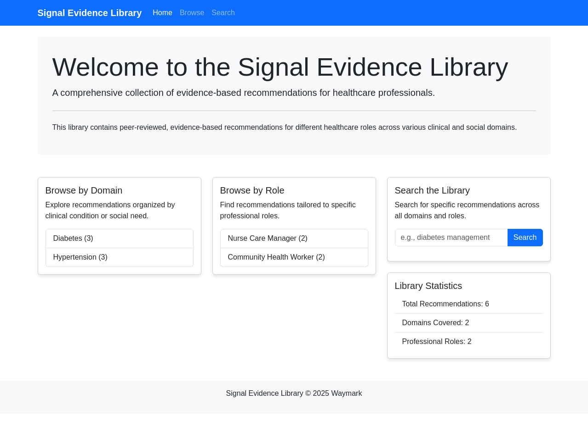

# Signal Evidence Library

A comprehensive collection of evidence-based recommendations for healthcare professionals working with Medicaid populations.

## Live Demo

The Signal Evidence Library is available for review at:
[https://5000-i1tvn0nlgjotz82h6jbgr-3aa1f08a.manus.computer](https://5000-i1tvn0nlgjotz82h6jbgr-3aa1f08a.manus.computer)

## Overview

The Signal Evidence Library serves as a RAG (Retrieval-Augmented Generation) database for Waymark's opportunity/next best action identification tool. It provides evidence-based, peer-reviewed recommendations for different healthcare roles across various clinical conditions and social needs.

### Key Features

- **Role-Based Organization**: Content tailored for nurses, social workers, CHWs, pharmacists, and care coordinators
- **Domain-Specific Content**: Organized by clinical conditions (diabetes, hypertension, etc.) and social needs
- **Evidence Tracking**: All recommendations include citation information and evidence levels
- **Semantic Search**: Natural language querying to find relevant recommendations
- **Web Interface**: User-friendly browsing and search capabilities

## Content Coverage

The library currently includes evidence-based recommendations for:

### Clinical Domains
- Diabetes
- Hypertension
- Mental Health (Depression, Anxiety, Substance Use)
- Respiratory Conditions (Asthma, COPD)
- Heart Failure
- Chronic Kidney Disease
- Post-MI Care
- Post-Stroke Care
- HIV Management
- Preventive Care

### Social Determinants of Health
- Housing
- Food Security
- Transportation

### Professional Roles
- Nurse Care Managers
- Clinical Pharmacists
- Community Health Workers
- Social Workers (Clinical and Non-Clinical)
- Care Coordinators
- Pharmacy Technicians

## Project Structure

- **`/config`**: Configuration files for domains and roles
- **`/data`**: 
  - **`/raw`**: Source recommendation data
  - **`/processed`**: Structured JSON files
  - **`/embeddings`**: Vector embeddings for semantic search
- **`/src`**: Source code
  - **`/api`**: API endpoints
  - **`/db`**: Database models and vector store
  - **`/pipeline`**: Content processing pipeline
  - **`/web`**: Web interface
- **`/scripts`**: Utility scripts
- **`/docs`**: Documentation

## Web Interface

The web interface allows users to:
1. Browse recommendations by domain or role
2. Search for specific topics or keywords
3. View detailed information about each recommendation
4. Access the evidence base supporting each recommendation

## Integration with Signal as a Service

This evidence library is designed to integrate with Waymark's existing Signal as a Service risk prediction tool, providing evidence-based recommendations for identified opportunities and next best actions.

## Development

### Prerequisites
- Python 3.8+
- Flask
- Sentence Transformers
- FAISS

### Setup
1. Clone the repository
2. Install dependencies: `pip install -r requirements.txt`
3. Run the processing script: `python scripts/process_content.py`
4. Generate embeddings: `python scripts/generate_embeddings.py`
5. Start the web interface: `python src/web/app.py`

## License

Copyright © 2025 Waymark
